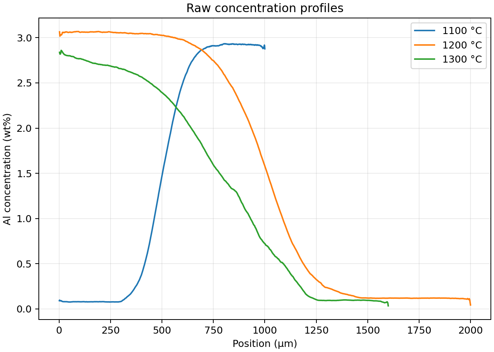
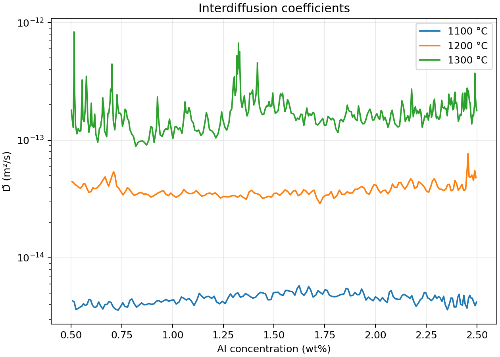
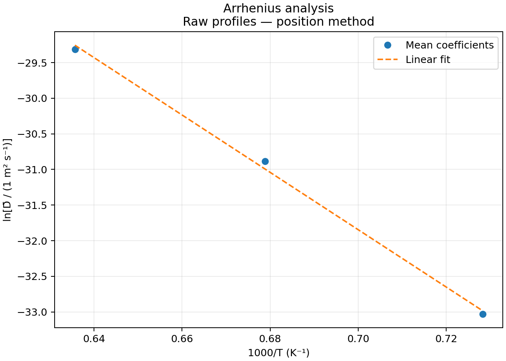

# Determination of the Interdiffusion Coefficient by Diffusion Couples

Python analysis of Co–Al concentration profiles at **1100, 1200, and 1300 °C**, using Boltzmann–Matano analysis and an Arrhenius fit over **0.5–2.5 wt% Al**.

The workflow now runs on the uploaded workbook. It preserves the measured profiles without smoothing and evaluates the BM integral in position space, avoiding inversion of noisy concentration data. Results are raw-profile estimates under the assumptions below, not independently validated material constants.

## Data

| Temperature | Annealing time | Observations |
|---|---|---|
| 1100 °C | 201 h | 1000 |
| 1200 °C | 151 h | 1000 |
| 1300 °C | 76 h | 800 |

`data/Boltzmann_Matano_CoAl.xlsx` is retained unchanged. The `1100C`, `1200C`, and `1300C` sheets provide position in column A (μm) and concentration in column B (wt% Al). Annealing times were confirmed against their parameter blocks. Existing calculation columns are not inputs to Python: the workbook contains formula errors documented in [the audit](docs/workbook-audit.md).

## 1. Concentration profiles

The script checks finite values and distinct positions, orders observations by position, and converts μm to m. No smoothing or removal of noisy observations is performed. Coordinate offsets alone do not establish physical displacement.



## 2. Matano planes

Let C_L and C_R be concentrations at the first and last position-ordered measurements. Define A(x) as the integral of C(x) − C_L from the left boundary to x. Integration by parts gives:

```text
x_M = x_R − A(x_R)/(C_R − C_L)
I(x) = (x − x_M)(C(x) − C_L) − A(x)
```

The script calculates A using trapezoid quadrature along position. This avoids constructing the potentially multivalued inverse x(C). The underlying mass-balance equation is unchanged. Noise remains in the data and derivatives.


## 3. Interdiffusion coefficients

```text
D̃(x) = −I(x) / [2t (dC/dx)]
```

Use positions in metres, annealing times in seconds, and coefficients in m²/s. Raw finite-difference gradients are used. Full output tables retain negative and undefined estimates for inspection. In this run every sample inside 0.5–2.5 wt% Al is finite and positive; no positivity filtering is needed in that interval.



The mean is the **arithmetic mean of sampled coefficients**, matching the original notebook convention. It is not a uniform-composition integral average.

| Temperature | Matano position (μm) | Mean D (m²/s) | Samples in mean |
|---|---:|---:|---:|
| 1100 °C | 501.106 | 4.51026338 × 10⁻¹⁵ | 185 |
| 1200 °C | 1010.428 | 3.85468597 × 10⁻¹⁴ | 180 |
| 1300 °C | 789.404 | 1.86222651 × 10⁻¹³ | 325 |

The temperature ordering is clear. However, D does not increase monotonically with concentration at every temperature. The unsmoothed 1300 °C result has substantial local variation.

## 4. Arrhenius analysis

```text
D̄(T) = D₀ exp[−Q/(RT)]
ln(D̄) = ln(D₀) − (Q/R)(1/T)
```

The fit uses natural logarithms of numerical coefficients expressed in m²/s and temperatures in kelvin. The displayed axis is 1000/T; regression uses 1/T. R = 8.314 J mol⁻¹ K⁻¹ is retained from the notebook.

For the uploaded profiles using position-space integration:

- **Q = 334.75 kJ/mol**
- **D₀ = 2.56963 × 10⁻² m²/s**
- **R² = 0.997589**



These differ from the earlier reported means and the workbook's cached results. See [the comparison](docs/workbook-audit.md). The earlier means reproduce Q = 317.93 kJ/mol, but reproducing that regression alone does not establish those means from this workbook.

Three temperatures do not establish a vacancy mechanism. Q is an apparent activation energy for the chosen composition-averaged coefficient, not automatically a vacancy formation-plus-migration energy.

## Run

Checked with Python 3.12.14. Tested package versions are in `requirements.txt`.

```bash
python -m pip install -r requirements.txt
python src/analysis.py --excel data/Boltzmann_Matano_CoAl.xlsx --output results/local-run
```

Each run requires a new output directory. Outputs comprise four figures, full coefficient tables, a mean table, diagnostics, and Arrhenius parameters.

To reproduce only the earlier reported-mean regression:

```bash
python src/analysis.py --reported-summary --output results/local-reported
```

The guarded earlier inverse-profile algorithm remains available with `--method inverse`. It stops on these nonmonotonic data. The position-space method is the default. The older workbook layout can also be read with an explicit `--position-unit m` or `--position-unit um`.

## Verification and limitations

```bash
python -m unittest discover -s tests -v
```

Five numerical checks pass, including an analytical constant-diffusivity profile, coordinate translation and reversed concentration orientation, known Arrhenius parameters, and invalid-input handling. The full workflow runs on the supplied workbook; all four figures were visually inspected.

- First and last concentrations are treated as terminal compositions. Some profile ends fluctuate or change abruptly; adequate terminal plateaus remain to be established.
- No smoothing is applied. Raw gradients can yield unstable local coefficients, especially near flat tails.
- Using wt% directly assumes it is proportional to the relevant concentration under a constant-density approximation. Density/volume variation and the physical reference frame remain to be established.
- The mean is a sample arithmetic average, which differs from uniform-composition averaging for unequal concentration spacing.
- No experimental uncertainty or endpoint-sensitivity study is included. Fit precision is not an uncertainty bound.

## Repository contents

| Path | Purpose |
|---|---|
| `src/analysis.py` | Calculations, validation, fitting, and plotting |
| `data/` | Unchanged source workbook and earlier reported summary |
| `results/workbook-position-analysis/` | Recalculated results from the uploaded data |
| `results/reported-summary-check/` | Fit from the earlier reported means |
| `docs/workbook-audit.md` | Source errors, corrections, and comparison |
| `tests/` | Independent numerical checks |

## Contribution and provenance

The supervisor provided the measurements. The author supplied the initial notebook code and reported results. The repository was organized and reviewed with AI assistance; position-space integration and numerical checks were added during review. Complete the experimental attribution and provenance of any adapted code before publication.

Confirm permission to share the supervisor-provided data before making the repository public. No licence has been selected. This package has not been published to GitHub.

## References

* S. Neumeier, H.U. Rehman, J. Neuner, C.H. Zenk, S. Michel, S. Schuwalow, J. Rogal, R. Drautz, M. Göken, **"Diffusion of solutes in fcc Cobalt investigated by diffusion couples and first principles kinetic Monte Carlo,"** *Acta Materialia*, vol. 106, pp. 304–313, 2016. DOI: [10.1016/j.actamat.2016.01.028](https://doi.org/10.1016/j.actamat.2016.01.028)
