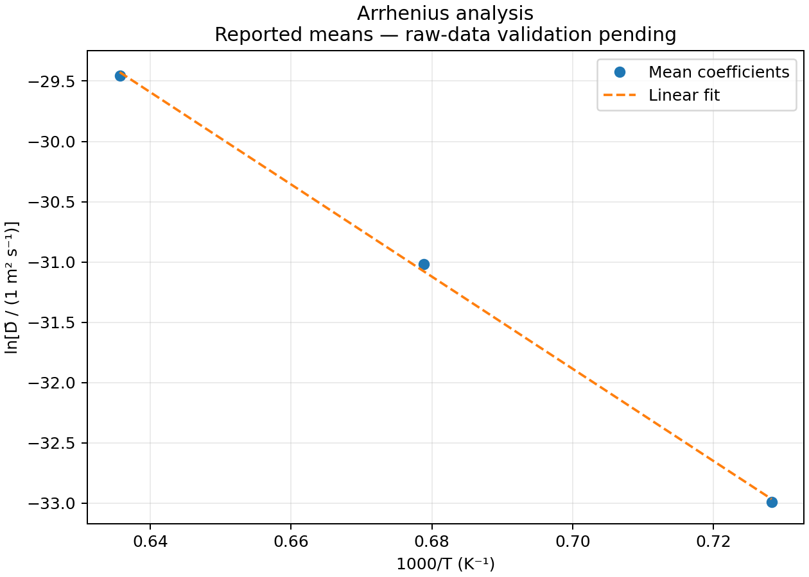

# Diffusion Coefficient Analysis

**Determination of interdiffusion coefficients in Co–Al diffusion couples using Boltzmann–Matano analysis.**

This project follows four stages: concentration profiles, Matano-plane determination, composition-dependent interdiffusion coefficients, and Arrhenius analysis. Python scripts, the input workbook, and calculated figures and tables are included.

| Temperature | Annealing time | Concentration interval for mean coefficients |
|---|---|---|
| 1100 °C | 201 h | 0.5–2.5 wt% Al |
| 1200 °C | 151 h | 0.5–2.5 wt% Al |
| 1300 °C | 76 h | 0.5–2.5 wt% Al |

## 1. Concentration profiles

Aluminum concentration is plotted against position across each diffusion couple. The profiles show the transition between the Co-rich and Al-enriched regions. Position is displayed in micrometres and concentration in weight percent aluminum.


**Python:** [01_concentration_profiles.py](src/01_concentration_profiles.py)

```bash
python src/01_concentration_profiles.py
```

The plotting operation is:

```python
ax.plot(position_m * 1e6, concentration_wt_percent, label=temperature)
ax.set_xlabel("Position (μm)")
ax.set_ylabel("Aluminum concentration (wt% Al)")
```

The input measurements are retained without smoothing. Sorting by position preserves the measured position–concentration pairs.

## 2. Matano planes

The Matano plane defines the mass-balance reference for the Boltzmann–Matano calculation. All three profiles and their Matano planes are shown together, with shaded regions on either side of each plane.

 

*Dashed lines match the color of each temperature profile. Shading illustrates the left and right regions; overlapping shades are not a quantitative measure of mass balance.*

For a profile with terminal concentrations $C_L$ and $C_R$, the mass-balance condition is

$$
\int_{C_L}^{C_R}\left[x(C)-x_M\right]\,\mathrm{d}C=0.
$$

The corresponding Matano-plane position is

$$
x_M=\frac{\displaystyle\int_{C_L}^{C_R}x(C)\,\mathrm{d}C}{C_R-C_L}.
$$

For numerical evaluation directly along the measured position coordinate, define

$$
A(x)=\int_{x_L}^{x}\left[C(\xi)-C_L\right]\,\mathrm{d}\xi.
$$

Integration by parts gives the equivalent expression used in the code:

$$
x_M=x_R-\frac{A(x_R)}{C_R-C_L}
=x_R-\frac{\displaystyle\int_{x_L}^{x_R}\left[C(x)-C_L\right]\,\mathrm{d}x}{C_R-C_L}.
$$

Here $x_L$ and $x_R$ are the left and right measurement boundaries, $C_L=C(x_L)$ and $C_R=C(x_R)$ are their concentrations, and $x_M$ is the Matano-plane position. The symbol $\xi$ is the position variable within the integral.

This avoids constructing an inverse $x(C)$ from fluctuating or repeated concentration measurements.

The calculation uses:

```python
area = np.trapezoid(C - C[0], x=x_m)
x_M = x_m[-1] - area / (C[-1] - C[0])
```

| Temperature | Matano-plane position |
|---|---:|
| 1100 °C | 501.11 μm |
| 1200 °C | 1010.43 μm |
| 1300 °C | 789.40 μm |

Positions refer to the original coordinate system of each measurement. Their differences alone do not establish physical movement of an interface.

## 3. Interdiffusion coefficients

The Boltzmann–Matano relation gives the local interdiffusion coefficient:

$$
\widetilde{D}(C_i)
=-\frac{1}{2t}
\left.\frac{\mathrm{d}x}{\mathrm{d}C}\right|_{C=C_i}
\int_{C_L}^{C_i}\left[x(C)-x_M\right]\,\mathrm{d}C.
$$

Here $C_i$ is the concentration at which the coefficient is evaluated, $t$ is the annealing time, and $\left.\mathrm{d}x/\mathrm{d}C\right|_{C_i}$ is the reciprocal of the local concentration gradient. The minus sign corresponds to the displayed integration limits from $C_L$ to $C_i$.

The position-space integral used in the implementation is

$$
I(x)=\left(x-x_M\right)\left[C(x)-C_L\right]-A(x),
$$

so the coefficient can equivalently be written as

$$
\widetilde{D}\bigl(C(x)\bigr)
=-\frac{I(x)}{2t\,\dfrac{\mathrm{d}C}{\mathrm{d}x}}.
$$

The integral is evaluated by parts along the measured position coordinate. Distances are converted to metres and annealing times to seconds, giving coefficients in m²/s.


**Python:** [03_interdiffusion_coefficients.py](src/03_interdiffusion_coefficients.py)

```bash
python src/03_interdiffusion_coefficients.py
```

The essential calculation is:

```python
A = cumulative_trapezoid(C - C[0], x=x_m, initial=0)
I = (x_m - x_M) * (C - C[0]) - A
gradient = np.gradient(C, x_m)
# The full implementation checks small gradients and invalid values.
D = -I / (2 * time_seconds * gradient)
```

Mean coefficients are calculated as the arithmetic mean of sampled values within **0.5–2.5 wt% Al**. All samples in that interval are finite and positive in this run.

| Temperature | Annealing time | Mean interdiffusion coefficient | Samples |
|---|---:|---:|---:|
| 1100 °C | 201 h | 4.510 × 10⁻¹⁵ m²/s | 185 |
| 1200 °C | 151 h | 3.855 × 10⁻¹⁴ m²/s | 180 |
| 1300 °C | 76 h | 1.862 × 10⁻¹³ m²/s | 325 |

[Download the numerical table](results/mean_coefficients.csv).

Higher temperatures give larger mean coefficients. The unsmoothed curves also show local fluctuations, especially at 1300 °C; they do not establish a uniformly increasing coefficient with composition.

## 4. Arrhenius analysis

The temperature dependence of the mean coefficient is described by

$$
\overline{D}(T)=D_0\exp\left(-\frac{Q}{RT}\right),
$$

which gives

$$
\ln\overline{D}=\ln D_0-\frac{Q}{R}\,\frac{1}{T}.
$$

For the fitted line $y=mu+b$, with $y=\ln\overline{D}$ and $u=1/T$,

$$
Q=-mR,\qquad D_0=\exp(b).
$$

Here $Q$ is the apparent activation energy, $D_0$ is the pre-exponential factor, $R$ is the gas constant, and $T$ is absolute temperature. Logarithms use numerical coefficient values expressed in m²/s.

The regression uses $1/T$, with temperature in kelvin. The graph displays $1000/T$ for readability.



**Python:** [04_arrhenius_analysis.py](src/04_arrhenius_analysis.py)

```bash
python src/04_arrhenius_analysis.py
```

```python
fit = linregress(1 / temperature_K, np.log(mean_D))
Q_kJ_mol = -fit.slope * 8.314 / 1000
D0_m2_s = np.exp(fit.intercept)
```

| Parameter | Value from the current calculation |
|---|---:|
| Apparent activation energy, $Q$ | 334.75 kJ/mol |
| Pre-exponential factor, $D_0$ | 2.570 × 10⁻² m²/s |
| $R^2$ | 0.997589 |

These are estimates from the supplied raw profiles and the stated averaging method. They differ from the earlier report's values of 317.93 kJ/mol and 5.988 × 10⁻³ m²/s. The [calculation notes](docs/calculation-notes.md) explain the numerical changes and comparison.

## Requirements

- Python 3.12 (tested with 3.12.14).
- NumPy, SciPy, pandas, Matplotlib, and openpyxl.

The tested versions are listed in [requirements.txt](requirements.txt).

## Installation and usage

Download or clone the repository, open a terminal in its folder, and install the dependencies:

```bash
python -m pip install -r requirements.txt
```

Run all four stages:

```bash
python run_analysis.py
```

On systems where Python is called `python3`, replace `python` with `python3`. Figures and numerical tables are written to `results/`; rerunning updates the generated files. To save a separate run:

```bash
python run_analysis.py --output results/new-run
```

Each stage can also run independently using the commands above. Stages 3 and 4 recompute their required coefficients from the workbook, so their results do not depend on previous notebook execution order.

## Project structure

| File or folder | Contents |
|---|---|
| `README.md` | Project explanation and main figures |
| `run_analysis.py` | Run all four stages |
| `src/01_concentration_profiles.py` | Run concentration-profile plotting |
| `src/02_matano_planes.py` | Run the combined Matano-plane plot |
| `src/03_interdiffusion_coefficients.py` | Run coefficient analysis and export the mean table |
| `src/04_arrhenius_analysis.py` | Run the Arrhenius fit |
| `src/workflow.py` | Shared plotting and file-handling functions |
| `src/diffusion.py` | Shared scientific calculations and validation |
| `data/` | Input workbook |
| `results/` | Four figures, coefficient tables, means, and fit parameters |
| `docs/calculation-notes.md` | Assumptions and comparison with earlier calculations |
| `tests/` | Numerical checks |

## Contribution and Provenance

The initial notebook code, reported results, position-space integration, and numerical checks were developed by the author. The raw dataset was obtained directly from experimental measurements and processed using a Python-based data analysis workflow rather than traditional Excel-based methods. Complete the attribution and provenance of any adapted code before publication.

## Reference

S. Neumeier, H.U. Rehman, J. Neuner, C.H. Zenk, S. Michel, S. Schuwalow, J. Rogal, R. Drautz, M. Göken, "Diffusion of solutes in fcc Cobalt investigated by diffusion couples and first principles kinetic Monte Carlo," Acta Materialia, vol. 106, pp. 304–313, 2016. DOI: 10.1016/j.actamat.2016.01.028
